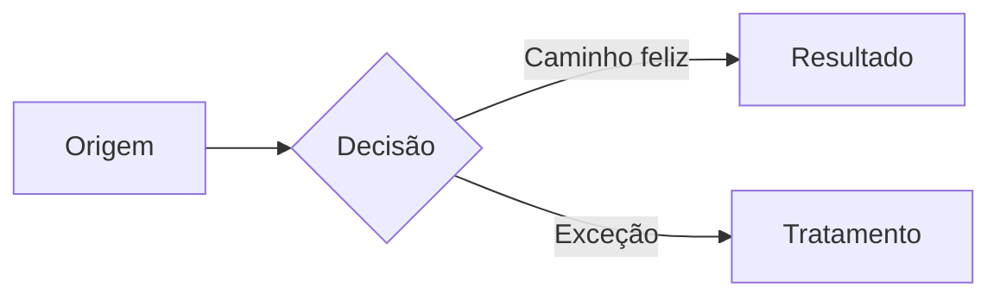

# Modelo — documento de projeto

Copie, apague o que não se aplica, preencha. Comentários entre `<!-- -->` **não** aparecem no
portal — mas apague mesmo assim antes de salvar.

---

````markdown
::: resumo
Em três linhas: o que este projeto entrega, para quem, e o que muda quando ficar pronto.
:::

## Por que agora

O que dói hoje, em fatos. Quantos cliques, quantas planilhas, quanto retrabalho, qual risco.
Se existe um número (16 notas por dia, 3 horas por semana), ele vale mais que um adjetivo.

> [!IMPORTANTE]
> A regra de negócio que o leitor precisa saber antes de qualquer outra coisa.

## Como funciona

Explicação do desenho. Uma seção por conceito, não uma por arquivo.


````

### Regra de <assunto>

O detalhe que não cabe no diagrama.

::: detalhes Cálculo completo
Passo a passo do cálculo, para quem precisar conferir.
:::

## Como se faz

::: passos

1. Primeiro passo, no imperativo, verificável
2. Segundo passo
3. Conferir o resultado em <tela>
   :::

> [!ATENÇÃO]
> O erro provável neste procedimento e como perceber que aconteceu.

## O que ficou de fora

- **<item>** — por que não entrou e o que acontece se alguém precisar.

::: pergunta Em aberto com o cliente

- <pergunta objetiva, que dá para responder com sim/não ou um número>
  :::

## Checklist

- [ ] <entrega verificável>
- [ ] <entrega verificável>

```

---

## Variações

**Documento de procedimento** (operação de campo): corte "Como funciona"; abra direto com
`::: passos` e feche com o `> [!CUIDADO]` do erro caro.

**Documento de decisão técnica** (ADR): "Por que agora" → "Opções consideradas" (`::: cards`
com uma opção por card) → "Decisão" (`> [!IMPORTANTE]`) → "Consequências".

**Documento de integração**: use `::: abas` separando `Portal` / `API` / `Banco`, e sempre um
bloco de código com `title=` apontando o arquivo real.
```
