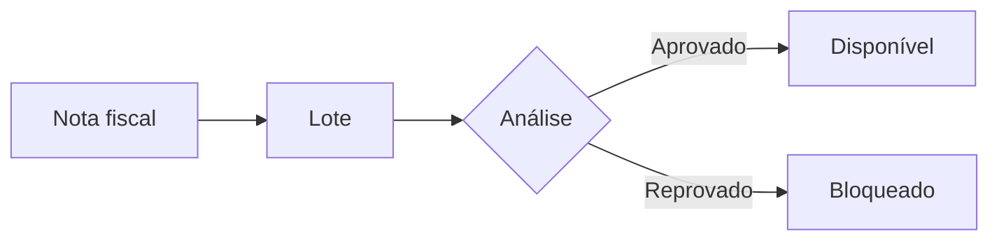

# Sintaxe completa — documento de projeto

Tudo que o `WMarkdownView` (suite `@wgalleti/primevue-components`) renderiza. Implementação:
`src/utils/markdown.ts` + `src/assets/markdown.css` no repositório da suite.

> [!NOTA]
> O que **não** está nesta lista é markdown padrão (parágrafo, ênfase, lista, link, citação) e
> funciona normalmente. HTML cru **não** funciona — é removido por segurança.

---

## Destaques (alertas)

Duas sintaxes, mesmo resultado. Use `>` para destaque curto; use `:::` quando precisar de
título próprio ou de mais de um parágrafo dentro.

```markdown
> [!DICA]
> Confira o saldo do lote antes de agendar a máquina.

> [!ATENÇÃO] Janela de plantio
> Depois de 10/11 a recomendação precisa ser refeita.

::: importante Regra de saldo
O saldo **nunca** é gravado: é sempre calculado a partir do ledger de movimentos.

Reabrir a nota estorna a entrada correspondente.
:::
```

Tipos e apelidos aceitos (maiúsculas, minúsculas e acento são indiferentes):

| Canônico     | Apelidos                                 | Cor                |
| ------------ | ---------------------------------------- | ------------------ |
| `NOTA`       | `note`, `info`, `observacao`             | info               |
| `DICA`       | `tip`, `hint`, `sugestao`                | verde              |
| `IMPORTANTE` | `important`                              | azul institucional |
| `ATENÇÃO`    | `warning`, `warn`, `aviso`, `attention`  | âmbar              |
| `CUIDADO`    | `caution`, `danger`, `error`, `perigo`   | vermelho           |
| `FEITO`      | `sucesso`, `success`, `done`             | verde              |
| `EXEMPLO`    | `example`                                | dourado            |
| `RESUMO`     | `summary`, `abstract`, `tldr`            | neutro             |
| `EM ABERTO`  | `pergunta`, `question`, `help`, `duvida` | roxo               |

Marcador desconhecido (`> [!QUALQUER]`) **não** vira alerta: continua uma citação normal.

---

## Passos

Procedimento numerado, com trilha ligando um passo ao outro. **Precisa ser lista ordenada
(`1.`)** — lista com `-` não numera.

```markdown
::: passos

1. Conferir o saldo do lote na tela de estoque
2. Registrar a saída pela transferência
3. Conferir o saldo de destino
   :::
```

Cada item aceita parágrafo, código e imagem dentro (indentados em 3 espaços).

---

## Cards

Lista em cartões lado a lado — bom para "o que existe hoje", opções, módulos.

```markdown
::: cards

- **Rastreio** — do talhão à nota fiscal, sem planilha
- **Análises** — laudo por lote, com histórico
- **Fertilizantes** — recomendação e aplicação
  :::
```

Precisa ser lista não ordenada. Grid se ajusta sozinho (mínimo ~14rem por card).

---

## Abas

Mesma informação em recortes diferentes (portal × API, antes × depois). Escreva um
`::: aba Título` atrás do outro — blocos vizinhos viram um grupo sozinhos, **sem wrapper**:

```markdown
::: aba Portal
O usuário fecha a nota e o lote nasce com saldo.
:::
::: aba API
`POST /api/v1/notas/{id}/fechar/` gera a entrada de estoque.
:::
```

A primeira aba abre selecionada. Um parágrafo entre dois blocos separa os grupos.

---

## Bloco colapsável

Detalhe que só interessa a parte dos leitores.

```markdown
::: detalhes Como o saldo é calculado
Soma das entradas menos as saídas do ledger, por lote e local.
:::
```

---

## Código

````markdown
```python title="apps/projetos/services/projeto.py"
def mover_projeto(projeto, novo_status, ordem=None):
    ...
```
````

- `title=` é opcional, mas use sempre que o trecho existir no repositório.
- Botão de copiar aparece no hover do bloco.
- Idiomas com realce: `bash`, `python`, `javascript`, `typescript`, `json`, `yaml`, `sql`,
  `xml`/`html`/`vue`, `css`, `diff`, `ini`/`dotenv`, `markdown`, `dockerfile`
  (+ apelidos: `sh`, `js`, `ts`, `py`, `yml`, `jsonc`, `psql`…). Idioma desconhecido não
  quebra — sai sem cor.

---

## Diagramas

````markdown

````

- Renderizado pelo mermaid, na paleta do portal, acompanhando claro/escuro.
- Tipos úteis aqui: `graph`/`flowchart` (fluxo), `sequenceDiagram` (conversa entre sistemas),
  `erDiagram` (modelo), `gantt` (cronograma), `stateDiagram-v2` (máquina de estados).
- Diagrama inválido não some: aparece o código-fonte com aviso.
- Rótulo com acento e espaço: use colchetes — `A[Nota fiscal]`.

---

## Texto

| Escreva           | Vira                                                             |
| ----------------- | ---------------------------------------------------------------- |
| `==destaque==`    | texto marcado (fundo dourado)                                    |
| `~~riscado~~`     | riscado                                                          |
| `++inserido++`    | sublinhado tracejado (verde)                                     |
| `H~2~O`           | subscrito                                                        |
| `m^2^`            | sobrescrito                                                      |
| `- [ ]` / `- [x]` | checklist (visual — a tarefa "de verdade" é a do painel lateral) |

Notas de rodapé:

```markdown
O ledger é append-only[^1].

[^1]: Nenhuma linha é apagada; estorno é um movimento novo.
```

Abreviação (aparece com tooltip pontilhada em toda ocorrência):

```markdown
\*[NF]: Nota Fiscal
```

Lista de definição (glossário):

```markdown
Lote
: Unidade rastreável de semente, com saldo próprio.

Talhão
: Área de plantio com geometria própria.
```

---

## Tabelas, imagens e links

- Tabela markdown padrão; rola sozinha na horizontal quando é larga.
- Imagem sozinha no parágrafo vira figura com legenda (o texto alternativo é a legenda):
  ``
- Link externo (`https://`) abre em nova aba e ganha o ícone `↗` automaticamente.
- Títulos ganham âncora (`#`) no hover — copie o link para apontar direto para a seção.

---

## Fora do portal

Quem abrir o markdown cru (GitHub, editor, terminal) vê:

- `> [!DICA]` — renderiza como alerta no GitHub, e como citação em qualquer outro lugar. **É a
  forma mais portátil.**
- `::: bloco` — aparece como texto literal `::: bloco`. Use quando o documento é para ser lido
  **no portal**.
